# Base de Dados — SIM (Sistema de Informações sobre Mortalidade)

## 1. Visão geral

Microdados de óbitos não fetais (CID-10) produzidos pelo Ministério da Saúde / DATASUS.

- **Tabela dbt:** `br_ms_sim__microdados` → `basedosdados-dev.br_ms_sim.microdados`
- **Fonte:** FTP DATASUS - `ftp://ftp.datasus.gov.br/dissemin/publicos/SIM/CID10/DORES/DO{uf}{ano}.dbc`
- **Pipeline Python:** `code/microdados/pipeline.py`

---

## 2. Investigações de qualidade de dados

> Registro das investigações solicitadas pelo gestor (jun/2026), cruzando **fonte original (`.dbc`)** com **BigQuery**, para entender falhas nos testes dbt antes de abrir o PR.

**Metodologia:**

1. Baixar `.dbc` do DATASUS e inspecionar colunas originais (`CONTADOR`, `DTOBITO`, `SEXO`, `CAUSABAS`).
2. Rodar queries equivalentes no BigQuery (`sequencial_obito`, `data_obito`, `sexo`, `causa_basica`).
3. Comparar contagens e concluir: **fonte** vs **pipeline legado**.
4. Reprocessar anos com erro de pipeline (2022).
5. Rodar `dbt test` novamente e documentar falhas remanescentes.
6. Registrar evidências (prints, queries, conclusão) neste README.

**Arquivos investigados (`.dbc`):** `DOSP2021.dbc`, `DOSP2022.dbc`, `DOSP2023.dbc`, `DOAC2021.dbc`, `DOAC2022.dbc`, `DOAC2023.dbc`  
**Local:** `code/microdados/input/investigacao/`

### Mapa: teste dbt → anos afetados → o que descobrimos

| Teste dbt que falhou | Anos no BQ com problema | O que a fonte (`.dbc`) mostra | Conclusão |
|----------------------|-------------------------|-------------------------------|-----------|
| `unique_combination_of_columns` | **2022** (27 UFs) | 2022 com `CONTADOR` preenchido | Erro no **pipeline legado** |
| `not_null` data_obito | **2022** (antes); **1996–2005** (depois) | 2022 com `DTOBITO` preenchido; 1996 com `DTOBITO` vazio/`00000000` (seção 5.3) | 2022 = pipeline; 1996–2005 = **fonte** 
| `not_null` sexo | 1997–1998, 2020–2024 | Códigos inválidos no DATASUS | **Fonte** (recode Stata) 
| `not_null` causa_basica | **2005** (PB, 1 registro) | Pendente `DOPB2005.dbc` | **Legado antigo** 

**Carga 2023/2024:** unicidade ok; `data_obito` sem null; `sexo` com ~500 null/ano (~0,03%) alinhado à fonte.

### 2.1 Fonte original (`.dbc`) - SP e AC, 2021–2023

Script utilizado:

```bash
cd code/microdados
uv run python - <<'PY'
import os, tempfile
from pathlib import Path
import pandas as pd
from datasus_dbc import decompress as dbc2dbf
from dbfread import DBF

def read_dbc(path):
    fd, tmp = tempfile.mkstemp(suffix=".dbf"); os.close(fd)
    try:
        dbc2dbf(str(path), tmp)
        return pd.DataFrame(iter(DBF(tmp, encoding="iso-8859-1", load=True)))
    finally:
        Path(tmp).unlink(missing_ok=True)

cols = ["CONTADOR", "DTOBITO", "SEXO", "CAUSABAS"]
for f in sorted(Path("input/investigacao").glob("DO*.dbc")):
    df = read_dbc(f)
    df.columns = df.columns.str.upper()
    print(f"\n=== {f.name} | n={len(df)} ===")
    for c in cols:
        if c not in df.columns:
            print(f"  {c}: coluna ausente"); continue
        s = df[c].astype(str).str.strip()
        nullish = s.isin(["", "None", "nan", "NaN"]) | s.isna()
        if c == "DTOBITO":
            nullish = nullish | s.eq("00000000")
        print(f"  {c}: null/invalid={nullish.sum()} | distintos={s[~nullish].nunique()}")
    if "SEXO" in df.columns:
        bad = ~df["SEXO"].astype(str).str.strip().isin(["1","2"])
        print(f"  SEXO invalido: {bad.sum()}")
PY
```

**Resultado:**

| Arquivo | n | CONTADOR null | DTOBITO null | CAUSABAS null | SEXO inválido (≠ 1,2) |
|---------|---|---------------|--------------|---------------|------------------------|
| DOAC2021.dbc | 5.496 | 0 | 0 | 0 | 11 |
| DOAC2022.dbc | 4.159 | 0 | 0 | 0 | 5 |
| DOAC2023.dbc | 4.189 | 0 | 0 | 0 | 7 |
| DOSP2021.dbc | 431.616 | 0 | 0 | 0 | 109 |
| DOSP2022.dbc | 354.056 | 0 | 0 | 0 | 73 |
| DOSP2023.dbc | 334.303 | 0 | 0 | 0 | 52 |

**Conclusão (fonte):** em 2022, `CONTADOR` e `DTOBITO` **não vêm null** no DATASUS. O comportamento é igual a 2021 e 2023. Códigos de `SEXO` inválidos existem na fonte e são convertidos para null no `cleaning.py` (recode Stata: `_nullify(df, "sexo", ["0", "6", "7", "9"])`).

---

## 3. BigQuery - evidências **antes** do reprocessamento de 2022

> Estado da tabela materializada quando os testes dbt falhavam por problema no legado de 2022.

### 3.1 Nulls por ano/UF (SP e AC, 2020–2024)

**Query:**

```sql
SELECT
  ano,
  sigla_uf,
  COUNT(*) AS n,
  COUNTIF(sequencial_obito IS NULL) AS sequencial_obito_null,
  COUNT(DISTINCT sequencial_obito) AS sequencial_obito_distintos,
  COUNTIF(data_obito IS NULL) AS data_obito_null,
  COUNTIF(causa_basica IS NULL) AS causa_basica_null,
  COUNTIF(sexo IS NULL) AS sexo_null
FROM `basedosdados-dev.br_ms_sim.microdados`
WHERE sigla_uf IN ('SP', 'AC')
  AND ano IN (2020, 2021, 2022, 2023, 2024)
GROUP BY ano, sigla_uf
ORDER BY sigla_uf, ano;
```

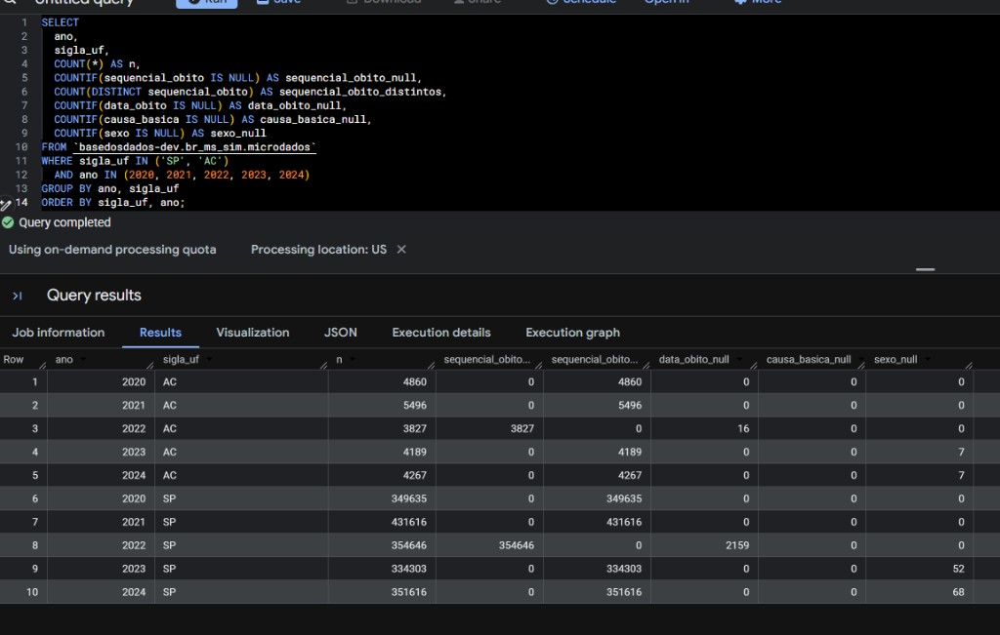

**Resultado (antes do reprocessamento):**

| ano | sigla_uf | n | sequencial_obito_null | sequencial_obito_distintos | data_obito_null | causa_basica_null | sexo_null |
|-----|----------|---|------------------------|----------------------------|-----------------|-------------------|-----------|
| 2020 | AC | 4.860 | 0 | 4.860 | 0 | 0 | 0 |
| 2021 | AC | 5.496 | 0 | 5.496 | 0 | 0 | 0 |
| **2022** | **AC** | **3.827** | **3.827** | **0** | **16** | 0 | 0 |
| 2023 | AC | 4.189 | 0 | 4.189 | 0 | 0 | 7 |
| 2024 | AC | 4.267 | 0 | 4.267 | 0 | 0 | 7 |
| 2020 | SP | 349.635 | 0 | 349.635 | 0 | 0 | 0 |
| 2021 | SP | 431.616 | 0 | 431.616 | 0 | 0 | 0 |
| **2022** | **SP** | **354.646** | **354.646** | **0** | **2.159** | 0 | 0 |
| 2023 | SP | 334.303 | 0 | 334.303 | 0 | 0 | 52 |
| 2024 | SP | 351.616 | 0 | 351.616 | 0 | 0 | 68 |

**Conclusão:** só **2022** aparece com `sequencial_obito` e `data_obito` null no BQ; 2020, 2021, 2023 e 2024 estão ok. Relaciona-se aos testes de **unicidade** e **`not_null` data_obito** (antes do reprocessamento).

---

### 3.2 Resumo por ano (todas as UFs)

**Query:**

```sql
SELECT
  ano,
  COUNT(*) AS n,
  COUNTIF(sequencial_obito IS NULL) AS sequencial_obito_null,
  COUNTIF(data_obito IS NULL) AS data_obito_null,
  COUNTIF(causa_basica IS NULL) AS causa_basica_null,
  COUNTIF(sexo IS NULL) AS sexo_null
FROM `basedosdados-dev.br_ms_sim.microdados`
WHERE ano IN (2020, 2021, 2022, 2023, 2024)
GROUP BY ano
ORDER BY ano;
```

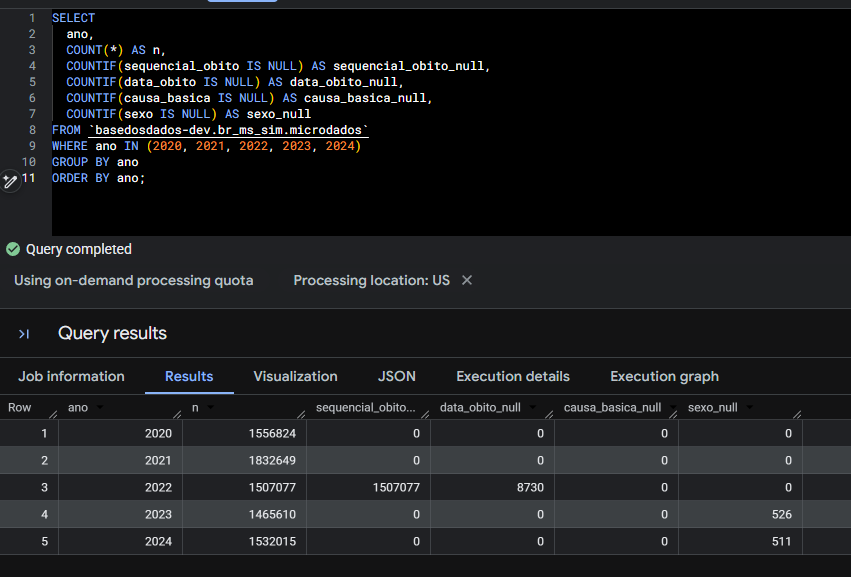

**Resultado (antes do reprocessamento):**

| ano | n | sequencial_obito_null | data_obito_null | causa_basica_null | sexo_null |
|-----|---|------------------------|-----------------|-------------------|-----------|
| 2020 | 1.556.824 | 0 | 0 | 0 | 0 |
| 2021 | 1.832.649 | 0 | 0 | 0 | 0 |
| **2022** | **1.507.077** | **1.507.077** | **8.730** | 0 | 0 |
| 2023 | 1.465.610 | 0 | 0 | 0 | 526 |
| 2024 | 1.532.015 | 0 | 0 | 0 | 511 |

**Conclusão:** 2022 inteiro no BQ com `sequencial_obito` 100% null (1,5M registros). Isso **não** aparece no `.dbc` original → **erro no pipeline legado**.

---

### 3.3 2022 por UF (`sequencial_obito`)

**Query:**

```sql
SELECT
  ano,
  sigla_uf,
  COUNT(*) AS n,
  COUNTIF(sequencial_obito IS NULL) AS sequencial_obito_null,
  COUNT(DISTINCT sequencial_obito) AS sequencial_obito_distintos
FROM `basedosdados-dev.br_ms_sim.microdados`
WHERE ano = 2022
GROUP BY ano, sigla_uf
ORDER BY sigla_uf;
```

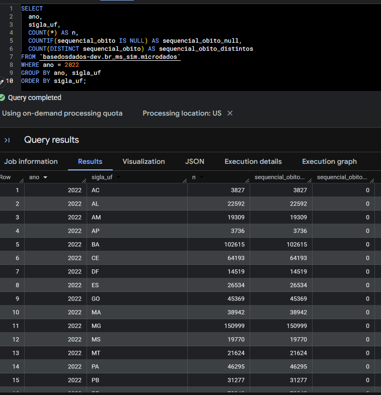

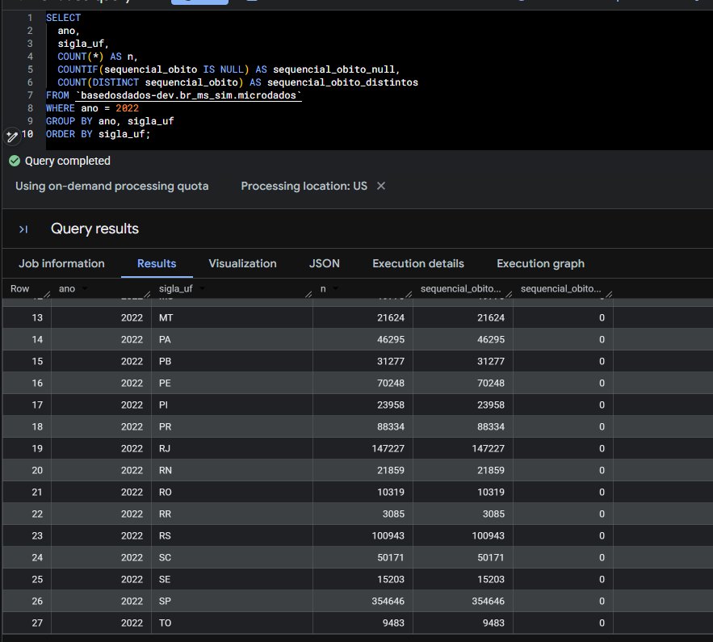

**Resultado:** nas **27 UFs**, `sequencial_obito_null = n` e `sequencial_obito_distintos = 0`.

| sigla_uf | n | sequencial_obito_null |
|----------|---|------------------------|
| AC | 3.827 | 3.827 |
| MG | 150.999 | 150.999 |
| SP | 354.646 | 354.646 |
| RJ | 147.227 | 147.227 |

**Conclusão:** o problema de `sequencial_obito` null em 2022 é **nacional** (27 UFs), não de uma UF específica. Explica as **27 falhas** no teste de unicidade.

---

### 3.4 SP 2022 — cruzamento `.dbc` × BQ

**Query:**

```sql
SELECT
  'BQ' AS fonte,
  COUNT(*) AS n,
  COUNTIF(sequencial_obito IS NULL) AS contador_null,
  COUNTIF(data_obito IS NULL) AS dtobito_null
FROM `basedosdados-dev.br_ms_sim.microdados`
WHERE ano = 2022 AND sigla_uf = 'SP';
```

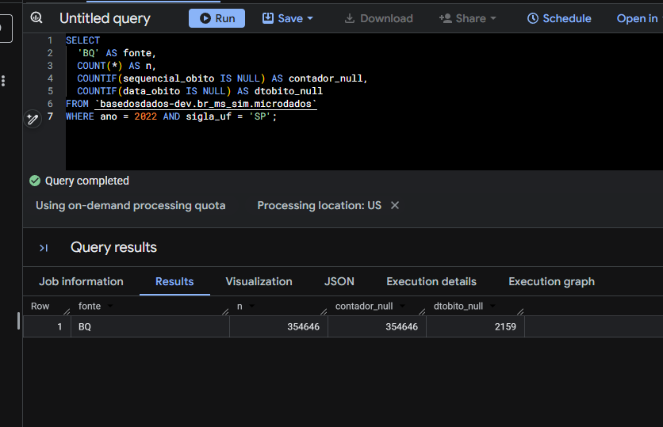

**Comparação:**

| fonte | n | CONTADOR/sequencial_obito null | DTOBITO/data_obito null |
|-------|---|--------------------------------|-------------------------|
| `.dbc` (DOSP2022) | 354.056 | **0** | **0** |
| BQ (antes) | 354.646 | **354.646 (100%)** | **2.159** |

**Conclusão:** prova direta de que o DATASUS **tem** os dados em 2022 e o BQ **não tinha** - confirma erro no tratamento/upload legado, não na fonte.

---

### 3.5 Unicidade — duplicatas `(ano, sigla_uf, sequencial_obito)`

**Query:**

```sql
SELECT
  ano,
  sigla_uf,
  sequencial_obito,
  COUNT(*) AS vezes
FROM `basedosdados-dev.br_ms_sim.microdados`
GROUP BY ano, sigla_uf, sequencial_obito
HAVING COUNT(*) > 1
ORDER BY ano, sigla_uf
LIMIT 50;
```

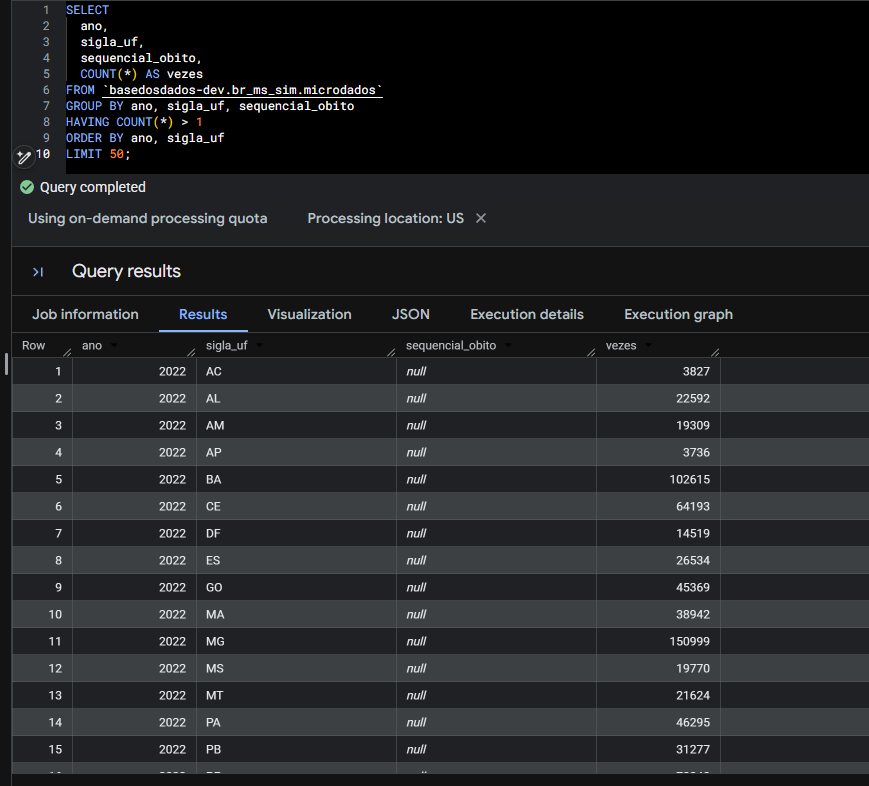

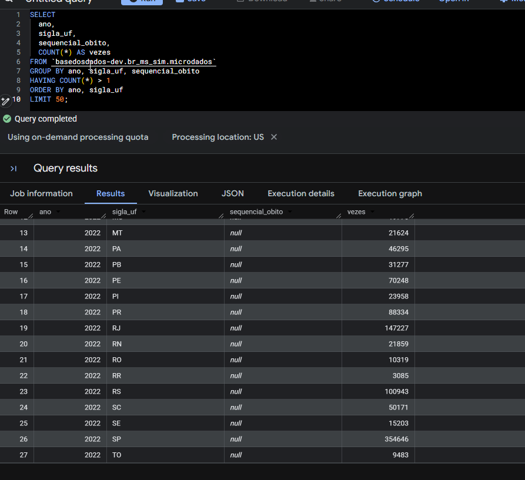

**Resultado (antes do reprocessamento):** 27 grupos duplicados, **todos** com `ano = 2022` e `sequencial_obito IS NULL`.

| ano | sigla_uf | sequencial_obito | vezes |
|-----|----------|------------------|-------|
| 2022 | BA | null | 102.615 |
| 2022 | MG | null | 150.999 |
| 2022 | SP | null | 354.646 |

**Conclusão:** falha do teste `dbt_utils.unique_combination_of_columns` era **efeito colateral** do `sequencial_obito` null em 2022, não duplicata real.

---

### 3.6 `sexo` null - 2023/2024 (SP e AC) vs `.dbc`

**Query:**

```sql
SELECT
  ano,
  sigla_uf,
  COUNT(*) AS n,
  COUNTIF(sexo IS NULL) AS sexo_null
FROM `basedosdados-dev.br_ms_sim.microdados`
WHERE ano IN (2023, 2024)
  AND sigla_uf IN ('SP', 'AC')
GROUP BY ano, sigla_uf
ORDER BY sigla_uf, ano;
```

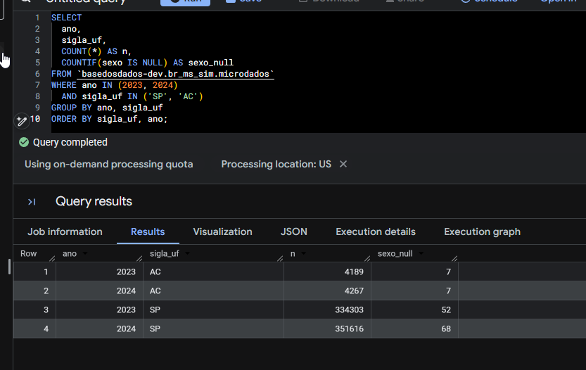

**Comparação com `.dbc`:**

| ano | sigla_uf | SEXO inválido (`.dbc`) | sexo_null (BQ) |
|-----|----------|------------------------|----------------|
| 2023 | AC | 7 | 7 |
| 2023 | SP | 52 | 52 |
| 2024 | AC | - | 7 |
| 2024 | SP | - | 68 |

<p align="center"></p>

**Conclusão:** nulls de `sexo` em 2023/2024 **batem com códigos inválidos na fonte**; o pipeline converte corretamente para null.

---

## 4. Reprocessamento de 2022 e resultados dos testes dbt

### 4.1 Ação tomada

Após confirmar no `.dbc` que 2022 tinha `CONTADOR` e `DTOBITO` preenchidos, reprocessamos 2022 com o pipeline Python atual:

# YEAR_RANGE = [2022] em pipeline.py
uv run python pipeline.py

cd ~/pipelines
uv run dbt run --select br_ms_sim__microdados
uv run dbt test --select br_ms_sim__microdados
```

`dbt run`: **OK** - tabela materializada com 34,3M linhas.

### 4.2 Resultado dos testes dbt - antes × depois

| Teste dbt | Antes (falhas) | Depois (falhas) | Status |
|-----------|----------------|-----------------|--------|
| `unique_combination_of_columns` (ano, sigla_uf, sequencial_obito) | 27 | **0** | **PASS** |
| `not_null` ano | 0 | 0 | **PASS** |
| `not_null` sigla_uf | 0 | 0 | **PASS** |
| `not_null` data_obito | 12.358 | **3.628** | FAIL |
| `not_null` sexo | 2.593 | **4.532** | FAIL |
| `not_null` causa_basica | 1 | **1** | FAIL |

**Resumo:** reprocessar 2022 **corrigiu unicidade** e removeu 8.730 nulls de `data_obito` (todos de 2022). As 3 falhas remanescentes são **histórico antigo** e **fonte**, não da carga 2023/2024.

---

## 5. BigQuery - evidências **após** reprocessamento de 2022

### 5.1 `data_obito` null - distribuição por ano (3.628 total)

**Query:**

```sql
SELECT
  ano,
  COUNT(*) AS n,
  COUNTIF(data_obito IS NULL) AS n_null
FROM `basedosdados-dev.br_ms_sim.microdados`
WHERE data_obito IS NULL
GROUP BY ano
ORDER BY ano;
```

**Resultado:**

| ano | n | n_null |
|-----|---|--------|
| 1996 | 796 | 796 |
| 1997 | 852 | 852 |
| 1998 | 1.088 | 1.088 |
| 1999 | 392 | 392 |
| 2000 | 497 | 497 |
| 2002 | 1 | 1 |
| 2004 | 1 | 1 |
| 2005 | 1 | 1 |
| **Total** | | **3.628** |

<p align="center">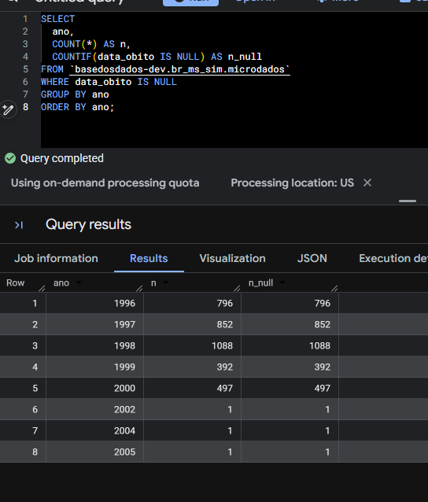</p>

**Conclusão:** todos os nulls de `data_obito` estão em **1996–2005** (histórico). **2022, 2023 e 2024: 0 null** após reprocessamento.

---

### 5.2 `sexo` null - distribuição por ano (4.532 total)

**Query:**

```sql
SELECT
  ano,
  COUNTIF(sexo IS NULL) AS n_null,
  COUNT(*) AS n
FROM `basedosdados-dev.br_ms_sim.microdados`
WHERE sexo IS NULL
GROUP BY ano
ORDER BY ano;
```

**Resultado:**

| ano | n_null |
|-----|--------|
| 1997 | 860 |
| 1998 | 693 |
| 1999 | 2 |
| 2005 | 1 |
| 2020 | 630 |
| 2021 | 683 |
| 2022 | 626 |
| 2023 | 526 |
| 2024 | 511 |
| **Total** | **4.532** |

<p align="center">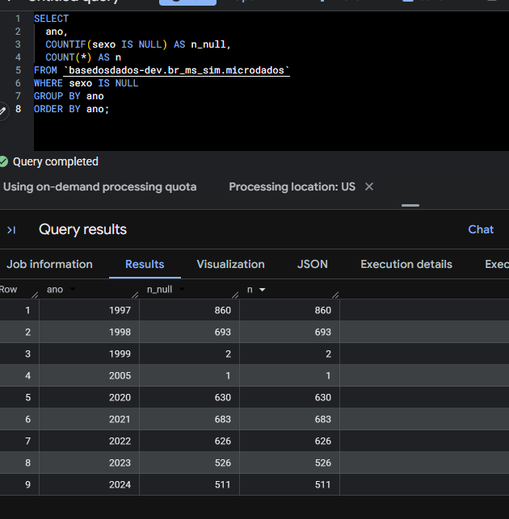</p>

**Query com contexto (total do ano):**

```sql
SELECT
  ano,
  COUNT(*) AS n,
  COUNTIF(sexo IS NULL) AS n_null
FROM `basedosdados-dev.br_ms_sim.microdados`
GROUP BY ano
HAVING n_null > 0
ORDER BY ano;
```

**Resultado:**

| ano | n (total ano) | n_null | % |
|-----|---------------|--------|---|
| 1997 | 903.516 | 860 | 0,10% |
| 1998 | 931.895 | 693 | 0,07% |
| 1999 | 938.658 | 2 | 0,00% |
| 2005 | 1.006.828 | 1 | 0,00% |
| 2020 | 1.556.824 | 630 | 0,04% |
| 2021 | 1.832.649 | 683 | 0,04% |
| 2022 | 1.544.266 | 626 | 0,04% |
| 2023 | 1.465.610 | 526 | 0,04% |
| 2024 | 1.532.015 | 511 | 0,03% |

<p align="center">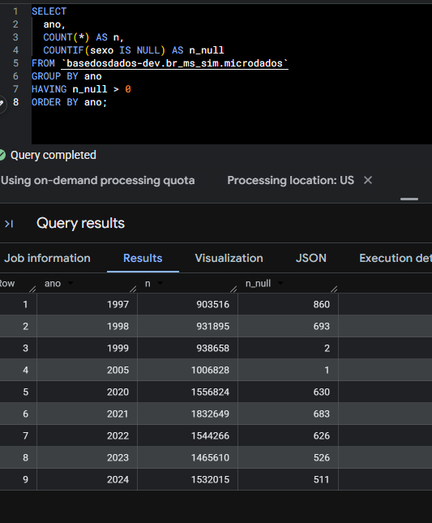</p>

**Conclusão:** nulls de `sexo` vêm de **códigos inválidos no DATASUS** (≠ 1, 2), convertidos para null pelo recode Stata. Em 2023/2024 são ~500/ano (~0,03%) - **comportamento esperado da fonte**, não erro de pipeline.

> **Nota:** o total de `sexo` null subiu de 2.593 para 4.532 após reprocessar 2022 porque o ano passou a ter recode correto (626 nulls reais da fonte), em vez de estar quebrado com `sequencial_obito` null.

---

### 5.3 `data_obito` null 1996 — fonte (`.dbc`) × BQ: nulls são da fonte

> Antes de reprocessar o histórico (1996–2019), validamos se os nulls de `data_obito` em 1996
> vinham do pipeline legado (como 2022) ou da própria fonte.

**Query (BQ):**

```sql
SELECT sigla_uf, COUNT(*) AS n, COUNTIF(data_obito IS NULL) AS n_null
FROM `basedosdados-dev.br_ms_sim.microdados`
WHERE ano = 1996
GROUP BY sigla_uf
HAVING n_null > 0
ORDER BY n_null DESC;
```

**Inspeção da fonte (`.dbc` de 1996, mesmo critério do `parse_date`):**

```bash
cd code/microdados
uv run python -c "
from extraction import download_file
from cleaning import read_dbc

for uf in ['MA', 'MG', 'GO', 'SP']:
    path = download_file(uf, 1996, './input')
    raw = read_dbc(str(path))
    raw.columns = raw.columns.str.upper()
    s = raw['DTOBITO'].astype(str).str.strip()
    raw_bad = (s.eq('') | s.eq('00000000') | (s.str.len() < 8)).sum()
    print(f'RAW DO{uf}1996: n={len(raw)} | DTOBITO invalido={raw_bad}')
"
```

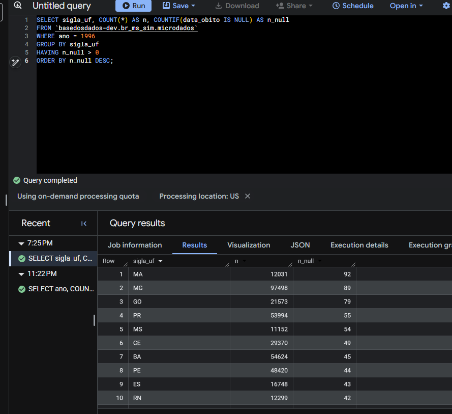

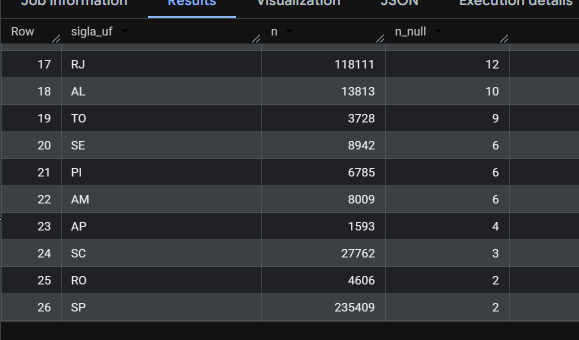

**Resultado — fonte × BQ batem exatamente:**

| UF (1996) | n (`.dbc`) | DTOBITO inválido (`.dbc`) | data_obito null (BQ) |
|-----------|------------|---------------------------|----------------------|
| MA | 12.031 | **92** | **92** |
| MG | 97.498 | **89** | **89** |
| GO | 21.573 | **79** | **79** |
| SP | 235.409 | **2** | **2** |

**Validação adicional do pipeline novo (SP 1996, raw × limpo):** `process_file` preserva as
235.409 linhas e gera exatamente 2 nulls de `data_obito` (mesmo número do raw), 4 de `sexo`
(códigos inválidos), 0 de `causa_basica` e 0 de `sequencial_obito`. O layout de 1996 (40 colunas)
é tratado corretamente pelo rename + `ensure_schema_columns`.

**Conclusão:** ao contrário de 2022, os nulls de `data_obito` em 1996–2005 **vêm da fonte**
(datas vazias/`00000000` no DATASUS). Reprocessar o histórico **não** remove esses nulls —
o teste `not_null data_obito` continuará falhando por dado legítimo da fonte. Ajuste correto:
`schema.yml` sem `not_null` nessas colunas (padrão queimadas), a alinhar com o gestor.

---

### 5.4 `causa_basica` null - 1 registro legado

**Query:**

```sql
SELECT
  ano,
  sigla_uf,
  sequencial_obito,
  causa_basica,
  data_obito,
  sexo
FROM `basedosdados-dev.br_ms_sim.microdados`
WHERE causa_basica IS NULL;
```

**Resultado:**

| ano | sigla_uf | sequencial_obito | causa_basica | data_obito | sexo |
|-----|----------|------------------|--------------|------------|------|
| 2005 | PB | null | null | null | null |

<p align="center">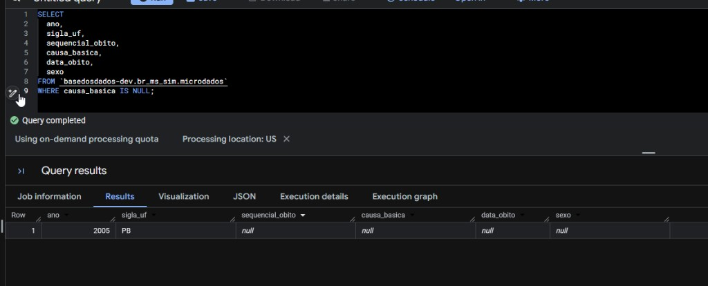</p>

**Conclusão:** único registro com todas as colunas-chave null — **legado de 2005, PB**. Fora da carga 2023/2024. Pendente checar `DOPB2005.dbc` na fonte.

---

### 5.5 Reprocessamento do histórico completo (1996–2019)

> Seguindo orientação do gestor (call de jun/2026): quando a ingestão passada teve problema,
> reprocessa-se **todo** o histórico. Rodado em 4 lotes (1996–2001, 2002–2007, 2008–2013,
> 2014–2019) com `pipeline.run()`, substituindo todas as partições legadas no GCS.
> Com isso, **100% da tabela (1996–2024) passou pelo pipeline Python atual.**

**`dbt test` — antes × depois do reprocessamento do histórico:**

| Teste dbt | Antes | Depois | Status |
|-----------|-------|--------|--------|
| `unique_combination_of_columns` | PASS | **PASS** | OK |
| `not_null` ano / sigla_uf | PASS | **PASS** | OK |
| `not_null` data_obito | 3.628 | **3.628 (idêntico)** | FAIL - **fonte** (ver 5.1 e 5.3) |
| `not_null` sexo | 4.532 | **10.771** | FAIL -**fonte** (ver abaixo) |
| `not_null` causa_basica | 1 | **1** | FAIL - registro PB 2005 |

**`data_obito`:** distribuição por ano **idêntica** à pré-reprocessamento (796/852/1.088/392/497
em 1996–2000 + 1 em 2002/2004/2005). Confirmação final de que esses nulls vêm da fonte —
nenhum reprocessamento os remove.

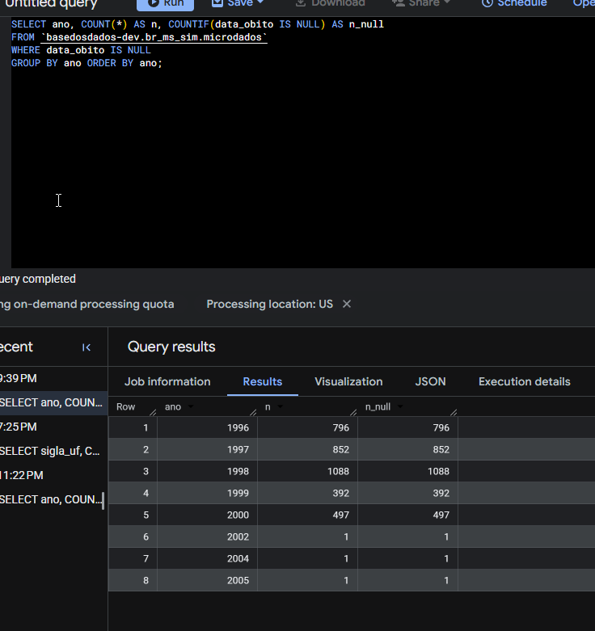

**`sexo` — por que subiu de 4.532 para 10.771?** Mesmo fenômeno já documentado na nota da
seção 5.2 (caso 2022): o pipeline legado **não aplicava o recode** nos anos antigos — códigos
inválidos (`0`, `6`, `7`, `9`) ficavam como texto em vez de null. Com o histórico reprocessado,
os códigos inválidos da fonte viraram null corretamente:

| ano | n | n_null | % |
|-----|---|--------|---|
| 1996 | 908.883 | 2.237 | 0,25% |
| 1997 | 903.516 | 1.250 | 0,14% |
| 1998 | 931.895 | 1.557 | 0,17% |
| 1999 | 938.658 | 1.075 | 0,11% |
| 2000 | 946.686 | 943 | 0,10% |
| 2001 | 961.492 | 732 | 0,08% |
| 2005 | 1.006.828 | 1 | 0,00% |
| 2020 | 1.556.824 | 630 | 0,04% |
| 2021 | 1.832.649 | 683 | 0,04% |
| 2022 | 1.544.266 | 626 | 0,04% |
| 2023 | 1.465.610 | 526 | 0,04% |
| 2024 | 1.532.015 | 511 | 0,03% |
| **Total** | | **10.771** | |

Perfil consistente com a fonte: anos 90 com mais códigos inválidos (0,08–0,25%), 2002–2019
praticamente zero (DATASUS passou a validar na entrada), 2020+ ~0,04%.

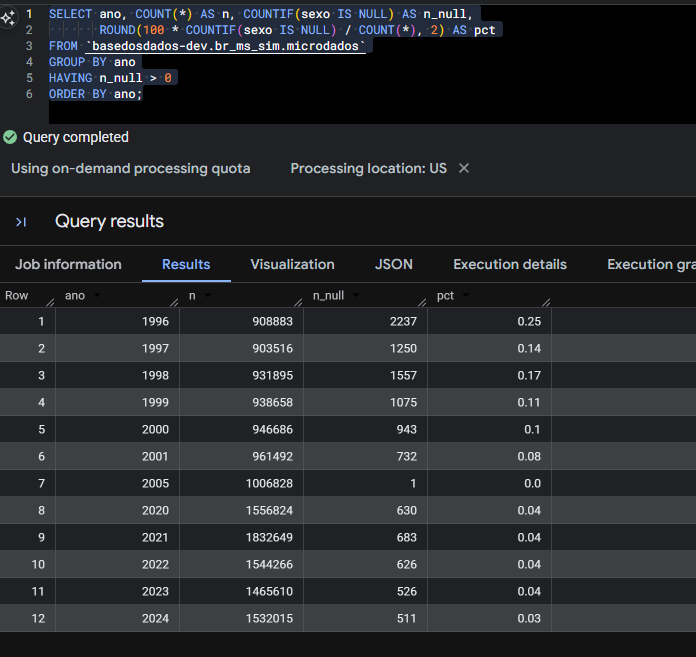

### 5.6 Comparação dev × prod (`data_obito`)

**Query no prod (`basedosdados.br_ms_sim.microdados`):**

| Ambiente | data_obito null total | Composição |
|----------|------------------------|------------|
| **prod** | **12.358** | 1996–2005 (3.628) **+ 2022 quebrado (8.730)** |
| **dev** | **3.628** | Só 1996–2005 (fonte) |

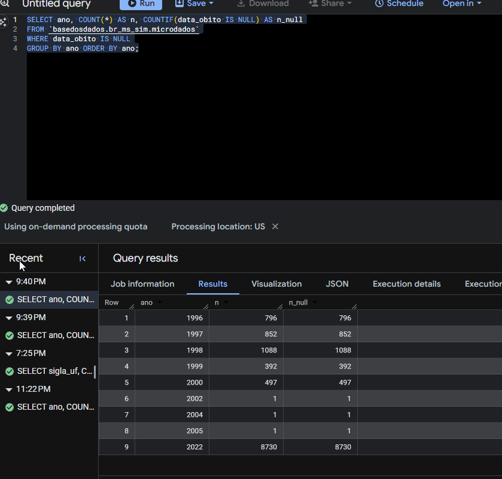

**Conclusão:** o prod ainda contém o **2022 quebrado pelo pipeline legado** (8.730 nulls de
`data_obito` que não existem no `.dbc`). O merge deste PR, além de adicionar 2023/2024,
**corrige 2022 em produção**. Os nulls de 1996–2005 são idênticos nos dois ambientes (fonte).

---

### 5.7 Decisão final: calibração dos testes no `schema.yml`

Com a prova de que os nulls remanescentes vêm da fonte (seções 5.3 e 5.5), os testes
`not_null` de `causa_basica`, `data_obito` e `sexo` foram substituídos por
`dbt_utils.not_null_proportion` com `at_least: 0.99`:

```yaml
- name: data_obito
  tests:
    # Fonte tem datas vazias/00000000 em 1996-2005 (~0,01%)
    - dbt_utils.not_null_proportion:
        at_least: 0.99
```

**Racional:**

- `not_null` puro é um contrato impossível: a fonte DATASUS produz nulls legítimos
  (datas vazias no histórico, códigos de sexo inválidos até hoje).
- Teste que sempre falha vira ruído e esconde regressões reais.
- A régua de 99% tolera os nulls da fonte (preenchimento real: 99,97%+), mas **reprova**
  um bug tipo o de 2022 (um ano inteiro nulo = ~4,4% da tabela → preenchimento ~95,6%).
- `not_null` puro mantido em `ano` e `sigla_uf` (chaves de partição); unicidade intocada.
- Precedente no repositório: `br_inpe_queimadas` (caso `risco_fogo`, null legítimo do
  histórico anual da fonte).

**Resultado: `dbt test` 6/6 PASS** (primeira execução completa sem falhas):

| Teste | Resultado |
|-------|-----------|
| `not_null_proportion` causa_basica (0.99) | PASS |
| `not_null_proportion` data_obito (0.99) | PASS |
| `not_null_proportion` sexo (0.99) | PASS |
| `unique_combination_of_columns` | PASS |
| `not_null` ano / sigla_uf | PASS |

---

## 6. Síntese final por teste dbt

| Teste dbt | Falhas (pós-reprocessamento completo 1996–2024) | Causa | Origem | Carga 2023/2024 | Ação |
|-----------|------------------------------|-------|--------|-----------------|------|
| `unique_combination_of_columns` | **0 - PASS** | `sequencial_obito` null em 2022 | Pipeline legado | OK (`dup = 0`) | **Concluído** - reprocessado 2022 |
| `not_null` ano | **PASS** |- | - | OK | - |
| `not_null` sigla_uf | **PASS** | - | - | OK | - |
| `not_null` data_obito | **3.628** | Datas vazias/`00000000` em 1996–2005 | **Fonte** (provado: `.dbc` × BQ batem, seção 5.3) | **0 null** | **Concluído** - `not_null_proportion 0.99` (seção 5.7) → PASS |
| `not_null` sexo | **10.771** | Códigos inválidos DATASUS (recode Stata) | **Fonte** (seção 5.5) | 526/511 por ano (~0,03%) | **Concluído** - `not_null_proportion 0.99` (seção 5.7) → PASS |
| `not_null` causa_basica | **1** | Registro PB 2005 todo null | Legado | OK | **Concluído** - `not_null_proportion 0.99` (seção 5.7) → PASS |

---

## 7. Ações pendentes

1. ~~Reprocessar 2022~~ - **concluído**
2. ~~Reprocessar histórico completo 1996–2019~~ - **concluído** (seção 5.5)
3. ~~Rodar `dbt run` e `dbt test`~~ - **concluído**
4. ~~Calibrar testes no `schema.yml`~~ - **concluído** (seção 5.7): `not_null_proportion`
   `at_least: 0.99` em `causa_basica`, `data_obito`, `sexo` → **`dbt test` 6/6 PASS**
5. Checar `DOPB2005.dbc` para o registro com `causa_basica` null (1 registro, baixa prioridade)
6. **Validar com gestor** a calibração da seção 5.7 no review do PR
7. **Atualizar PR** com este README, imagens em `docs/investigacao/` e resumo da investigação

---

## 8. Outras particularidades do pipeline

### 8.1 Conversão de município (IBGE 6 → 7 dígitos)

O DATASUS fornece códigos IBGE de 6 dígitos. O pipeline converte para 7 dígitos usando o diretório oficial:

- Tabela: `basedosdados-dev.br_bd_diretorios_brasil.municipio`
- Colunas: `id_municipio_6` → `id_municipio`
- Implementação: `load_municipios()` em `code/microdados/cleaning.py`

### 8.2 Particionamento Hive no GCS

Os CSVs de staging **não** incluem `ano` e `sigla_uf` no arquivo (90 colunas). Essas colunas vêm do path GCS: `ano=YYYY/sigla_uf=UF/`.

### 8.3 Script auxiliar de investigação BQ

`code/microdados/investigate_bq.py` — replica as queries deste README.

> **Nota SQL:** no BigQuery, `nulls` é palavra reservada. Usar alias como `n_null` em vez de `nulls`.

---

## 9. Índice de imagens

| Arquivo | Conteúdo |
|---------|----------|
| `01_bq_nulls_sp_ac_2020_2024.png` | Nulls SP/AC antes do reprocessamento |
| `02_bq_resumo_por_ano.png` | Resumo por ano antes do reprocessamento |
| `03_bq_2022_sequencial_obito_ufs_1.png` | 2022 sequencial_obito null - UFs (parte 1) |
| `04_bq_2022_sequencial_obito_ufs_2.png` | 2022 sequencial_obito null - UFs (parte 2) |
| `05_bq_causa_basica_null_2005_pb.png` | Registro causa_basica null - PB 2005 |
| `06_bq_duplicatas_2022_1.png` | Duplicatas unicidade 2022 (parte 1) |
| `07_bq_duplicatas_2022_2.png` | Duplicatas unicidade 2022 (parte 2) |
| `08_bq_sexo_null_2023_2024.png` | sexo null 2023/2024 SP e AC |
| `09_bq_sp_2022_cruzamento.png` | Cruzamento SP 2022 `.dbc` × BQ |
| `10_bq_data_obito_null_por_ano.png` | data_obito null por ano (pós-reprocessamento) |
| `11_bq_sexo_null_por_ano.png` | sexo null por ano (pós-reprocessamento) |
| `12_bq_sexo_null_por_ano_contexto.png` | sexo null com total do ano (pós-reprocessamento) |
| `13_bq_1996_data_obito_null_por_uf_1.png` | 1996 data_obito null por UF - fonte × BQ (parte 1) |
| `14_bq_1996_data_obito_null_por_uf_2.png` | 1996 data_obito null por UF - fonte × BQ (parte 2) |
| `15_bq_data_obito_null_pos_historico.png` | data_obito null por ano - pós-reprocessamento do histórico |
| `16_bq_prod_data_obito_null_por_ano.png` | data_obito null por ano no **prod** (2022 ainda quebrado) |
| `17_bq_sexo_null_pos_historico.png` | sexo null por ano - pós-reprocessamento do histórico |

---

## 10. Referências

- FTP DATASUS SIM: `ftp://ftp.datasus.gov.br/dissemin/publicos/SIM/CID10/DORES/`
- Diretório municípios BD: `basedosdados.br_bd_diretorios_brasil.municipio`
- Investigação realizada em: junho/2026
- Reprocessamento 2022 concluído em: junho/2026
