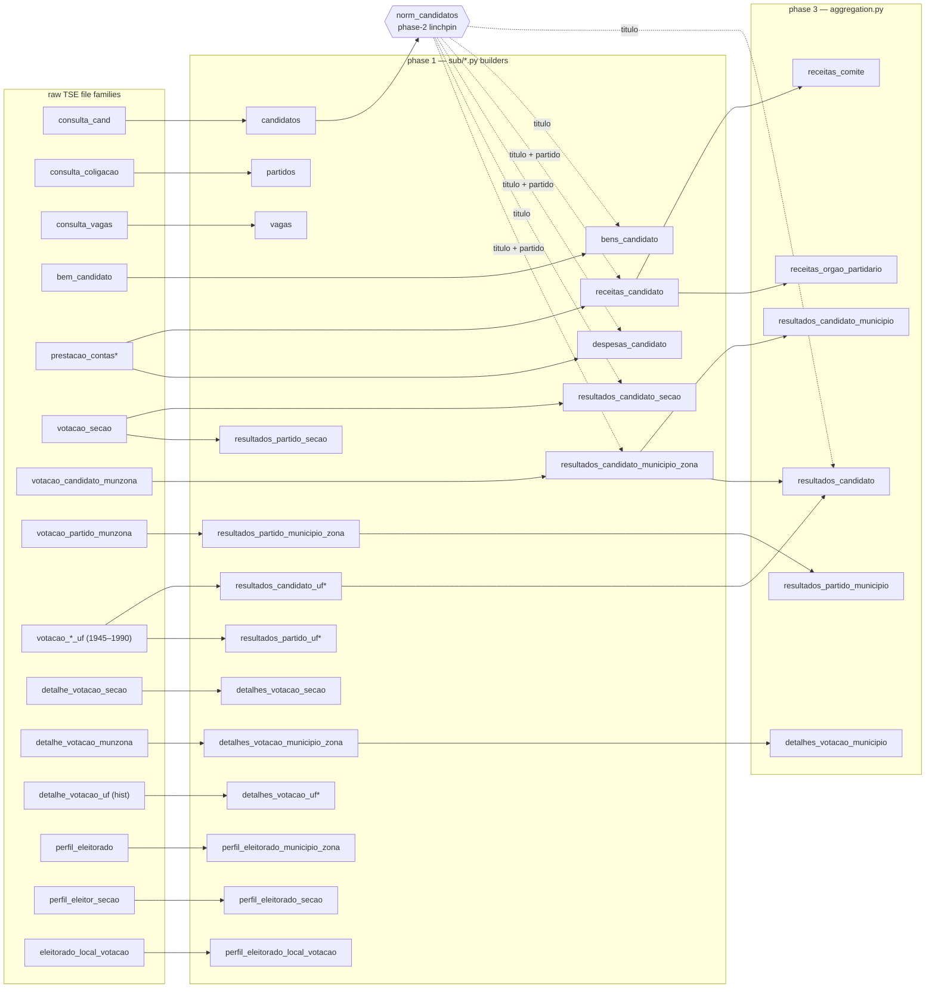

# `br_tse_eleicoes` — Schema Diagnosis (Stata → Python refactor)

This document is the output of the schema-validation harness in
`code/python/diagnostics/`. It validates every year-conditional positional
column mapping in `code/python/sub/*.py` against the **official TSE layouts**
(file header rows and leiame docs, fetched without downloading any data — see
`diagnostics/tier2_leiame.py`), and maps the blast radius of any mapping error
through the table dependency graph below.

Motivation: PR #1564 fixed a positional-mapping bug in `bens_candidato`
(years ≤ 2012) where values landed in the wrong columns, surfacing as invalid
`sigla_uf`. This harness checks the same failure class statically for **every
table × year**.

How to re-run (from `code/python/`):

```bash
TSE_DATA_DIR=/tmp/dados_TSE uv run --with pdfplumber python -m diagnostics run --tier 1
TSE_DATA_DIR=/tmp/dados_TSE uv run --with pdfplumber python -m diagnostics run --tier 2
TSE_DATA_DIR=/tmp/dados_TSE uv run --with pdfplumber python -m diagnostics run --tier 3
TSE_DATA_DIR=/tmp/dados_TSE uv run --with pdfplumber python -m diagnostics report
```

## Table-level dependency graph

A mapping error in `candidatos` poisons `norm_candidatos` and through it the
`titulo_eleitoral_candidato` columns of five downstream tables; errors in the
`*_municipio_zona` and `receitas_candidato` builders propagate into every
phase-3 aggregation.



`*` = historical intermediates (1945–1990), surfaced only through the all-years
`resultados_candidato` rollup (and `detalhes_votacao_uf`, not published as a
DBT model).

## How the validation works

- **Tier 1 (static)** — AST-extracts all 56 mapping sites (positional
  `vN → column` dicts and paired select/rename lists) from the 14 builders,
  resolves the year set each `if ano ...` block covers, and checks that every
  expected year is covered exactly once. Artifacts: `diagnostics/artifacts/tier1/`.
- **Tier 2 (official layouts)** — for each raw file family × year, obtains the
  official ordered column layout. TSE republishes all years in the modern
  format and those files carry a header row (verified back to 1994) — the
  header is the layout. Acquisition order: local raw header → local leiame →
  remote zip via **HTTP Range requests** (only the header/leiame bytes are
  fetched, never the data). Artifacts: `diagnostics/artifacts/layouts/`.
- **Tier 3 (cross-check)** — for each site × year, the official variable at
  position N must be affinity-compatible with the BD column the code assigns
  to `vN` (`SG_UF → sigla_uf`, `DS_CARGO → cargo`, …; see
  `diagnostics/affinity.py`). Incompatibilities with a header-backed layout
  are FAIL; with a PDF-parsed leiame, WARN.

Caveats:

- The check validates **schema positions**, not values. Row-level concerns
  (e.g. `drop_first_row` flags, null-sentinel handling) and aggregation logic
  (phase 2/3) are out of scope; data-level fingerprinting (BigQuery
  dev-vs-prod) is a possible follow-up once schema findings are resolved.
- Official layouts describe TSE's *current* republication of each year. That
  is the correct reference: the pipeline parses those republished files.

## Key findings (2026-06-09)

1. **The root cause of every FAIL is the same: TSE re-republished a subset of
   historical files in its current-generation layout** (federation columns
   added, demographic block reordered, columns inserted), while the Python
   builders — faithfully transcribed from the Stata code — still index the
   *previous* republication. Whoever re-downloads raw data today and runs the
   pipeline gets silently shifted columns for the flagged year-blocks. The
   Stata-era outputs (and anything built from the old downloads) are not
   affected.
2. **The corruption is real, not theoretical.** The locally built
   `candidatos_1994.parquet` (from the freshly downloaded
   `/tmp/dados_TSE/input/consulta_cand/`) carries gender codes in
   `titulo_eleitoral`, marital-status codes in `genero` and party numbers in
   `situacao` — exactly the PR #1564 failure class, now in the **linchpin
   table**: `candidatos` feeds `norm_candidatos`, which enriches
   `titulo_eleitoral_candidato` in bens/receitas/despesas/resultados (see
   graph above).
3. **Affected (FAIL, header-confirmed):**
   `candidatos` 1994 1996 2014 2018 2020 2022 ·
   `partidos` 1994–2014 + 2018 2020 ·
   `vagas` 1994–2012 ·
   `detalhes_votacao_municipio_zona` 1996–2016 ·
   `perfil_eleitorado_municipio_zona` 2008–2016, 2020–2024 (2024: TSE inserted
   `TP_OBRIGATORIEDADE_VOTO` *after* the refactor was written) ·
   `resultados_candidato_municipio_zona` 1994 1996 2016 2018–2022 ·
   `resultados_partido_municipio_zona` 1996 2016 ·
   `despesas_candidato` 2014 ·
   `receitas_candidato`/`despesas_candidato` 2002–2016 are clean after
   verifying TSE's idiosyncratic header names (see `affinity.py` whitelist).
4. **Clean:** `bens_candidato` (all years — confirms PR #1564), the historical
   `resultados_*_uf` 1945–1990, `detalhes_votacao_secao`, seção results,
   `perfil_eleitorado_local_votacao`, receitas/despesas 2018+.
5. **Detector self-validated:** run against the pre-PR-#1564 code
   (`git show ab14dc52^`), it flags exactly years ≤ 2012 of `build_bens` with
   the mismatches that PR fixed (`v9=descricao_item` reading `SG_UF`, …), and
   is clean on the fixed code.
6. **Recommended fix:** stop hardcoding positional indices per year-block.
   Since every republished file carries a header row (verified back to 1994),
   read by header name (the `artifacts/layouts/*.json` give the exact
   name→column mapping per family × year); positional blocks remain necessary
   only for the headerless historical `*_uf` files (whose leiame-derived
   layouts validate OK today). Until then, any year-block flagged ✗ must not
   be run against freshly downloaded data.

## Prod-data validation (2026-06-10)

The diagnosis was tested against the materialized production tables in
`basedosdados.br_tse_eleicoes` (queries in
`python/diagnostics/prod_validation.sql`, Q1–Q14; ~3 GB processed, billed to
`basedosdados-dev`). Each FAIL cell predicts a falsifiable symptom in the data
(e.g. `vagas.vagas ← SG_UF` ⇒ NULL after int cast; `votos ← SQ_COLIGACAO` ⇒
absurd magnitudes), checked per year against the same table's clean years.

**Verdict: the root cause is confirmed in prod, where the build timing exposes
it.** Most FAIL cells are *latent* — prod was last built from older-generation
downloads in which the positional indices were still correct — but every prod
anomaly found sits exactly on a flagged cell, and two are the predicted shifts:

| Prod anomaly | Probe | Evidence | Match with diagnosis |
|---|---|---|---|
| `bens_candidato` 2014 — **smoking gun** | Q9, Q13 | all 83,053 rows carry a single digit (3–8) in `titulo_eleitoral_candidato`; every other year ≈100% valid 10–13-digit titles | exactly the predicted `candidatos` 2014 shift `v41: titulo_eleitoral ← CD_GRAU_INSTRUCAO` (education-level codes 1–8), propagated through the `norm_candidatos` merge — proves the bens build consumed a corrupted `candidatos` 2014 build |
| `resultados_candidato_municipio_zona` 1994 — **smoking gun** | Q6, Q12 | `votos = 0` in all 842,223 rows (`resultado`/`sigla_partido` sane) | predicted shift `v40: votos ← SG_FEDERACAO` — blank pre-federation ⇒ parses empty ⇒ 0 |
| `candidatos` 1996 | Q1, Q10 | the entire demographic block (`titulo_eleitoral`, `genero`, `estado_civil`, `instrucao`, `nacionalidade`, `municipio_nascimento`) is NULL in all 10,356 rows | 1996 is a flagged year; consistent with the 1996 layout drift (cannot have been parsed from the current republished file, which carries all these fields) |
| `detalhes_votacao_municipio_zona` 1996 | Q4, Q11 | only 548 rows across 19 UFs (comparable municipal years: ~12k) and `aptos_totalizadas = -3` (TSE `#NULO#` sentinel) in 100% of rows | flagged year; degraded source generation + uncleaned sentinel |
| `perfil_eleitorado_municipio_zona` 2008/2016 | Q5, Q14 | mixed value domains inside one partition: ~3.6M/4.1M rows with raw TSE codes (`genero` ∈ 0/2/4, ~35 voters/row) plus a residue with text labels (`masculino`/`feminino`, ~200 voters/row) | flagged years; two build generations coexist in the same `ano` partition |

Clean in prod (latent FAILs — will corrupt on the next rebuild from fresh
downloads): `partidos` (all years), `vagas` 1994–2012, `despesas_candidato`
2014, `candidatos` 1994/2014/2018/2020/2022,
`detalhes_votacao_municipio_zona` 2000–2016,
`resultados_candidato_municipio_zona` 1996/2016–2022,
`resultados_partido_municipio_zona` 1996/2016. Positive control:
`bens_candidato` shows 0% UF-siglas in `descricao_item` in every year — the
PR #1564 fix is in prod.

Immediate prod repair candidates (independent of the code fix):
`bens_candidato` 2014, `resultados_candidato_municipio_zona` 1994,
`candidatos` 1996, `detalhes_votacao_municipio_zona` 1996,
`perfil_eleitorado_municipio_zona` 2008/2016.

## Dependency-chain propagation (2026-06-10)

Each confirmed prod anomaly predicts corruption in the tables *downstream* of
it in the dependency graph: phase-3 aggregations inherit their input's values,
and phase-2 titulo merges inherit whatever `norm_candidatos` build they ran
against. These predictions were tested in prod (queries Q15–Q18 in
`prod_validation.sql`, ~1.6 GB):

| Edge | Upstream anomaly | Downstream check | Result |
|---|---|---|---|
| `rcmz → resultados_candidato_municipio` (agg) | rcmz 1994 votos = 0 | rcm 1994 | **propagated** — all 705,492 rows votos = 0 (control 1998: 0 zeros, max 3.29M) |
| `rcmz → resultados_candidato` (all-years agg) | same | rc 1994 | **propagated** — all 6,719 rows votos = 0 |
| `candidatos → norm_candidatos → rcmz/rcs/rc` (titulo merge) | candidatos 1996 demographic block NULL | titulo_eleitoral_candidato, ano = 1996 | **propagated** — 100% NULL in rcmz (74,903 rows), rcs (4,075,079 rows) and rc (9,983 rows); controls 0.7–13% NULL |
| `candidatos → norm_candidatos → bens/receitas/despesas/rcmz/rcs` (titulo merge, 2014) | corrupted candidatos-2014 vintage (bens smoking gun) | titulo in receitas/despesas/rcmz/rcs 2014 | **not propagated** — 0 single-digit titles, ≥ 99.7% valid; only the `bens_candidato` 2014 build consumed the corrupted vintage — phase-2 enrichment ran from different `candidatos` builds per table |
| `dvmz → detalhes_votacao_municipio` (agg) | dvmz 1996 coverage collapse (548 rows / 19 UFs) | dvm 1996 | **propagated** — 242 municipalities / 19 UFs vs ~11,200 / 26 UFs in 2000/2004; the −3 sentinel does not surface (dvm aggregates `aptos`), but the coverage hole does |

Two consequences:

1. **The corrupted prod surface is larger than the six source cells.** Adding
   the propagated cells: `resultados_candidato_municipio` 1994,
   `resultados_candidato` 1994 and 1996,
   `resultados_candidato_municipio_zona` 1996 (titulo column),
   `resultados_candidato_secao` 1996 (titulo column), and
   `detalhes_votacao_municipio` 1996 — eleven corrupted table × year cells in
   total. Note rcmz/rcs 1996 are corrupted *despite their own raw parsing
   being clean*: the corruption arrived through the merge edge.
2. **Repair must follow topological order.** Rebuilding a downstream table
   before its upstream source is wasted work: fix `candidatos` 1996 →
   rebuild `norm_candidatos` → re-run phase 2 for rcs/rcmz 1996 → re-run the
   phase-3 rollups (rc). Likewise rcmz 1994 before rcm/rc 1994, and dvmz 1996
   before dvm 1996. The Q17 result also shows builds must be *atomic per
   batch*: mixing `candidatos` vintages across phase-2 runs is exactly what
   produced the bens 2014 smoking gun.

## Conclusion

The hypothesis that motivated this diagnosis is confirmed end-to-end. The
Stata → Python refactor faithfully preserved positional column mappings that
were correct for the TSE downloads available when the Stata code was written —
but TSE silently re-republishes historical files in its current-generation
layout, so those positions no longer hold for 62 of the 256 verifiable
table × year cells. The failure mode is the worst kind: no parse error, no
type error, just values landing in the wrong columns.

Three independent lines of evidence converge:

1. **Static** — the harness cross-checked all 56 positional mapping sites
   against TSE's official layouts (file headers and leiame documents) and
   found 62 header-confirmed mismatches, with zero coverage gaps. The detector
   self-validated: it flags exactly the bug PR #1564 fixed when run against
   the pre-fix code, and is clean on the fixed code.
2. **Local** — a fresh download parsed with the current code produces
   demonstrably shifted columns (`candidatos_1994.parquet`: gender codes in
   `titulo_eleitoral`, marital-status codes in `genero`).
3. **Production** — every data anomaly found in
   `basedosdados.br_tse_eleicoes` sits on a cell flagged by the harness, and
   two are the predicted shifts column-for-column (`bens_candidato` 2014
   carrying `CD_GRAU_INSTRUCAO` codes as voter-registration IDs;
   `resultados_candidato_municipio_zona` 1994 with all 842k vote counts
   zeroed). No probe found corruption in an unflagged cell — the harness has,
   so far, neither false negatives in prod nor false alarms.

The practical consequence: **prod is partially corrupted today, and any
rebuild from fresh downloads would corrupt far more.** Most flagged cells are
clean in prod only because the last build predates TSE's latest
republication — that protection disappears on the next refresh.

Recommended actions, in order:

1. **Gate rebuilds**: do not run any ✗-flagged year-block against freshly
   downloaded data until the builders are fixed; run
   `python -m diagnostics run --tier 3` (non-zero exit on FAIL) as a
   pre-build check.
2. **Fix the builders**: replace hardcoded positional indices with read-by-
   header-name wherever the file carries a header (verified back to 1994);
   keep positional blocks only for the headerless historical `*_uf` files.
   `artifacts/layouts/*.json` provide the exact name → column mapping per
   family × year.
3. **Repair prod in topological order**: eleven table × year cells are
   corrupted — six at the source plus five reached through aggregation and
   merge edges (see "Dependency-chain propagation"). Rebuild upstream-first:
   `candidatos` 1996 → `norm_candidatos` → rcs/rcmz 1996 → rc 1996;
   rcmz 1994 → rcm/rc 1994; dvmz 1996 → dvm 1996; then the leaf cells
   (`bens_candidato` 2014, `perfil_eleitorado_municipio_zona` 2008/2016).
   Keep each batch's `candidatos` vintage atomic across phase-2 runs — mixed
   vintages are what produced the bens 2014 smoking gun.
4. **Keep the harness in the loop**: TSE inserted a column
   (`TP_OBRIGATORIEDADE_VOTO`, 2024) *after* this refactor was written —
   republication drift is ongoing, not a one-off. Re-running tiers 2–3 after
   each TSE refresh turns this class of silent corruption into a loud,
   pre-build failure.

<!-- diagnostics:begin -->

*Auto-generated by `python -m diagnostics report` on 2026-06-28.*

**Summary:** 162 OK · 28 WARN · 62 FAIL · 4 without official layout (site x year checks).

### Status matrix

#### 1945-1990

| table | 45 | 47 | 50 | 54 | 55 | 58 | 60 | 62 | 65 | 66 | 70 | 74 | 78 | 82 | 86 | 89 | 90 |
|---|---|---|---|---|---|---|---|---|---|---|---|---|---|---|---|---|---|
| `detalhes_votacao_uf` | ⚠ | ⚠ | ⚠ | ⚠ | ⚠ | ⚠ | ⚠ | ⚠ | ⚠ | ⚠ | ⚠ | ⚠ | ⚠ | ⚠ | ⚠ | ⚠ | ⚠ |
| `partidos` |   |   |   |   |   |   |   |   |   |   |   |   |   |   |   |   | ✓ |
| `resultados_candidato_uf` | ✓ | ✓ | ✓ | ✓ | ✓ | ✓ | ✓ | ✓ | ✓ | ✓ | ✓ | ✓ | ✓ | ✓ | ✓ | ✓ | ✓ |
| `resultados_partido_uf` | ✓ | ✓ | ✓ | ✓ | ✓ | ✓ | ✓ | ✓ | ✓ | ✓ | ✓ | ✓ | ✓ | ✓ | ✓ |   | ✓ |

#### 1994-2024

| table | 94 | 96 | 98 | 00 | 02 | 04 | 06 | 08 | 10 | 12 | 14 | 16 | 18 | 20 | 22 | 24 |
|---|---|---|---|---|---|---|---|---|---|---|---|---|---|---|---|---|
| `bens_candidato` |   |   |   |   |   |   | ✓ | ✓ | ✓ | ✓ | ✓ | ✓ | ✓ | ✓ | ✓ | ✓ |
| `candidatos` | ✗ | ✗ | ✓ | ✓ | ✓ | ✓ | ✓ | ✓ | ✓ | ✓ | ✗ | ✓ | ✗ | ✗ | ✗ | ✓ |
| `despesas_candidato` |   |   |   |   | ✓ | ✓ | ✓ | ✓ | ✓ | ✓ | ✗ | ✓ | ✓ | ✓ | ✓ | ✓ |
| `detalhes_votacao_municipio_zona` | ✓ | ✗ | ✓ | ✗ | ✗ | ✗ | ✗ | ✗ | ✗ | ✗ | ✗ | ✗ | ✓ | ✓ | ✓ | ✓ |
| `detalhes_votacao_secao` | · | · | ✓ | ✓ | ✓ | ✓ | ✓ | ✓ | ✓ | ✓ | ✓ | ✓ | ✓ | ✓ | ✓ | ✓ |
| `partidos` | ✗ | ✗ | ✗ | ✗ | ✗ | ✗ | ✗ | ✗ | ✗ | ✗ | ✗ | ✓ | ✗ | ✗ | ✓ | ✓ |
| `perfil_eleitorado_local_votacao` |   |   |   |   |   |   |   |   | ✓ | ✓ | ✓ | ✓ | ✓ | ✓ | ✓ | ✓ |
| `perfil_eleitorado_municipio_zona` | ✓ | ✓ | ✓ | ✓ | ✓ | ✓ | ✓ | ✗ | ✗ | ✗ | ✗ | ✗ | ✓ | ✗ | ✗ | ✗ |
| `perfil_eleitorado_secao` |   |   |   |   |   |   |   | ⚠ | ⚠ | ⚠ | ⚠ | ⚠ | ⚠ | ⚠ | ⚠ | ✓ |
| `receitas_candidato` |   |   |   |   | ✓ | ✓ | ✓ | ✓ | ✓ | ✓ | ⚠ | ✓ | ✓ | ✓ | ✓ | ✓ |
| `resultados_candidato_municipio_zona` | ✗ | ✗ | ✓ | ✓ | ✓ | ✓ | ✓ | ✓ | ✓ | ✓ | ✓ | ✗ | ✗ | ✗ | ✗ | ✓ |
| `resultados_candidato_secao` | · | · | ⚠ | ✓ | ✓ | ✓ | ✓ | ⚠ | ✓ | ✓ | ✓ | ✓ | ✓ | ✓ | ✓ | ✓ |
| `resultados_partido_municipio_zona` | ✓ | ✗ | ✓ | ✓ | ✓ | ✓ | ✓ | ✓ | ✓ | ✓ | ✓ | ✗ | ✓ | ✓ | ✓ | ✓ |
| `vagas` | ✗ | ✗ | ✗ | ✗ | ✗ | ✗ | ✗ | ✗ | ✗ | ✗ | ✓ | ✓ | ✓ | ✓ | ✓ | ✓ |

Legend: ✓ OK · ⚠ WARN (low-confidence layout) · ✗ FAIL · `·` no official layout acquired

### Findings

#### FAIL: `candidatos` — OUT_OF_RANGE

- block: `sub/candidates.py::_parse_schema` line 30
- years: 1994, 1996, 2014, 2018
- layout source: header

| ano | raw col | code maps to | official variable |
|---|---|---|---|
| 1994 | | | `{'v': 'v51', 'bd': 'ocupacao', 'layout_len': 50}` |
| 1994 | | | `{'v': 'v54', 'bd': 'resultado', 'layout_len': 50}` |

#### FAIL: `candidatos` — POSITIONAL_MAPPING_MISMATCH

- block: `sub/candidates.py::_parse_schema` line 30
- years: 1994, 1996, 2014, 2018
- layout source: header

| ano | raw col | code maps to | official variable |
|---|---|---|---|
| 1994 | `v26` | `situacao` | `NR_PARTIDO` |
| 1994 | `v29` | `sigla_partido` | `NR_FEDERACAO` |
| 1994 | `v35` | `nacionalidade` | `DS_COMPOSICAO_COLIGACAO` |
| 1994 | `v38` | `municipio_nascimento` | `NR_TITULO_ELEITORAL_CANDIDATO` |
| 1994 | `v39` | `data_nascimento` | `CD_GENERO` |
| 1994 | `v41` | `titulo_eleitoral` | `CD_GRAU_INSTRUCAO` |
| 1994 | `v43` | `genero` | `CD_ESTADO_CIVIL` |
| 1994 | `v45` | `instrucao` | `CD_COR_RACA` |
| 1994 | `v47` | `estado_civil` | `CD_OCUPACAO` |
| 1994 | `v49` | `raca` | `CD_SIT_TOT_TURNO` |

#### FAIL: `candidatos` — OUT_OF_RANGE

- block: `sub/candidates.py::_parse_schema` line 61
- years: 2020, 2022
- layout source: header

| ano | raw col | code maps to | official variable |
|---|---|---|---|
| 2020 | | | `{'v': 'v51', 'bd': 'estado_civil', 'layout_len': 50}` |
| 2020 | | | `{'v': 'v53', 'bd': 'raca', 'layout_len': 50}` |
| 2020 | | | `{'v': 'v55', 'bd': 'ocupacao', 'layout_len': 50}` |
| 2020 | | | `{'v': 'v58', 'bd': 'resultado', 'layout_len': 50}` |

#### FAIL: `candidatos` — POSITIONAL_MAPPING_MISMATCH

- block: `sub/candidates.py::_parse_schema` line 61
- years: 2020, 2022
- layout source: header

| ano | raw col | code maps to | official variable |
|---|---|---|---|
| 2020 | `v26` | `situacao` | `NR_PARTIDO` |
| 2020 | `v29` | `sigla_partido` | `NR_FEDERACAO` |
| 2020 | `v39` | `nacionalidade` | `CD_GENERO` |
| 2020 | `v40` | `sigla_uf_nascimento` | `DS_GENERO` |
| 2020 | `v42` | `municipio_nascimento` | `DS_GRAU_INSTRUCAO` |
| 2020 | `v43` | `data_nascimento` | `CD_ESTADO_CIVIL` |
| 2020 | `v45` | `titulo_eleitoral` | `CD_COR_RACA` |
| 2020 | `v47` | `genero` | `CD_OCUPACAO` |
| 2020 | `v49` | `instrucao` | `CD_SIT_TOT_TURNO` |

#### FAIL: `despesas_candidato` — POSITIONAL_MAPPING_MISMATCH

- block: `sub/campaign_finance.py::_build_despesas_2014` line 1635
- years: 2014
- layout source: header

| ano | raw col | code maps to | official variable |
|---|---|---|---|
| 2014 | `v7` | `sigla_partido` | `Sigla da UE` |
| 2014 | `v8` | `numero_candidato` | `Nome da UE` |
| 2014 | `v9` | `cargo` | `Sigla  Partido` |
| 2014 | `v12` | `tipo_documento` | `Nome candidato` |
| 2014 | `v13` | `numero_documento` | `CPF do candidato` |
| 2014 | `v14` | `cpf_cnpj_fornecedor` | `CPF do vice/suplente` |
| 2014 | `v15` | `nome_fornecedor` | `Tipo de documento` |
| 2014 | `v16` | `nome_fornecedor_rf` | `Número do documento` |
| 2014 | `v17` | `cnae_2_fornecedor` | `CPF/CNPJ do fornecedor` |
| 2014 | `v18` | `descricao_cnae_2_fornecedor` | `Nome do fornecedor` |
| 2014 | `v20` | `valor_despesa` | `Cod setor econômico do fornecedor` |
| 2014 | `v21` | `tipo_despesa` | `Setor econômico do fornecedor` |

#### FAIL: `detalhes_votacao_municipio_zona` — POSITIONAL_MAPPING_MISMATCH

- block: `sub/voting_details_mun_zone.py::build_detalhes_mun_zona` line 108
- years: 1996, 2000, 2002, 2004, 2006, 2008, 2010, 2012, 2014, 2016
- layout source: header

| ano | raw col | code maps to | official variable |
|---|---|---|---|
| 1996 | `v22` | `aptos_totalizadas` | `QT_SECOES_NAO_INSTALADAS` |
| 1996 | `v23` | `secoes_totalizadas` | `QT_TOTAL_SECOES` |
| 1996 | `v25` | `abstencoes` | `QT_ELEITORES_SECOES_NAO_INSTALADAS` |
| 1996 | `v27` | `votos_nominais` | `ST_VOTO_EM_TRANSITO` |
| 1996 | `v28` | `votos_brancos` | `QT_VOTOS` |
| 1996 | `v29` | `votos_nulos` | `QT_VOTOS_CONCORRENTES` |
| 1996 | `v30` | `votos_legenda` | `QT_TOTAL_VOTOS_VALIDOS` |

#### FAIL: `partidos` — POSITIONAL_MAPPING_MISMATCH

- block: `sub/parties.py::build_partidos` line 53
- years: 1994, 1998, 2002, 2006, 2010
- layout source: header

| ano | raw col | code maps to | official variable |
|---|---|---|---|
| 1994 | `v4` | `turno` | `CD_TIPO_ELEICAO` |
| 1994 | `v7` | `sigla_uf` | `CD_ELEICAO` |
| 1994 | `v10` | `cargo` | `SG_UF` |
| 1994 | `v11` | `tipo_agremiacao` | `SG_UE` |
| 1994 | `v12` | `numero` | `NM_UE` |
| 1994 | `v13` | `sigla` | `CD_CARGO` |
| 1994 | `v14` | `nome` | `DS_CARGO` |
| 1994 | `v16` | `nome_coligacao` | `NR_PARTIDO` |
| 1994 | `v17` | `composicao_coligacao` | `SG_PARTIDO` |
| 1994 | `v18` | `sequencial_coligacao` | `NM_PARTIDO` |

#### FAIL: `partidos` — POSITIONAL_MAPPING_MISMATCH

- block: `sub/parties.py::build_partidos` line 84
- years: 1996, 2000, 2004, 2008, 2012
- layout source: header

| ano | raw col | code maps to | official variable |
|---|---|---|---|
| 1996 | `v4` | `turno` | `CD_TIPO_ELEICAO` |
| 1996 | `v6` | `sigla_uf` | `NR_TURNO` |
| 1996 | `v7` | `id_municipio_tse` | `CD_ELEICAO` |
| 1996 | `v10` | `cargo` | `SG_UF` |
| 1996 | `v11` | `tipo_agremiacao` | `SG_UE` |
| 1996 | `v12` | `numero` | `NM_UE` |
| 1996 | `v13` | `sigla` | `CD_CARGO` |
| 1996 | `v14` | `nome` | `DS_CARGO` |
| 1996 | `v16` | `nome_coligacao` | `NR_PARTIDO` |
| 1996 | `v17` | `composicao_coligacao` | `SG_PARTIDO` |
| 1996 | `v18` | `sequencial_coligacao` | `NM_PARTIDO` |

#### FAIL: `partidos` — POSITIONAL_MAPPING_MISMATCH

- block: `sub/parties.py::build_partidos` line 122
- years: 2014, 2018
- layout source: header

| ano | raw col | code maps to | official variable |
|---|---|---|---|
| 2014 | `v19` | `sequencial_coligacao` | `NR_FEDERACAO` |
| 2014 | `v20` | `nome_coligacao` | `NM_FEDERACAO` |
| 2014 | `v21` | `composicao_coligacao` | `SG_FEDERACAO` |

#### FAIL: `partidos` — POSITIONAL_MAPPING_MISMATCH

- block: `sub/parties.py::build_partidos` line 157
- years: 2020
- layout source: header

| ano | raw col | code maps to | official variable |
|---|---|---|---|
| 2020 | `v19` | `sequencial_coligacao` | `NR_FEDERACAO` |
| 2020 | `v20` | `nome_coligacao` | `NM_FEDERACAO` |
| 2020 | `v21` | `composicao_coligacao` | `SG_FEDERACAO` |

#### FAIL: `perfil_eleitorado_municipio_zona` — POSITIONAL_MAPPING_MISMATCH

- block: `sub/voter_profile_mun_zone.py::build_perfil_mun_zona` line 21
- years: 2008, 2010, 2012, 2014, 2016, 2020, 2022
- layout source: header

| ano | raw col | code maps to | official variable |
|---|---|---|---|
| 2008 | `v7` | `situacao_biometria` | `NR_ZONA` |
| 2008 | `v9` | `zona` | `DS_GENERO` |
| 2008 | `v10` | `genero` | `CD_ESTADO_CIVIL` |
| 2008 | `v12` | `estado_civil` | `CD_FAIXA_ETARIA` |
| 2008 | `v14` | `grupo_idade` | `CD_GRAU_ESCOLARIDADE` |
| 2008 | `v16` | `instrucao` | `CD_RACA_COR` |
| 2008 | `v18` | `eleitores` | `CD_IDENTIDADE_GENERO` |
| 2008 | `v19` | `eleitores_biometria` | `DS_IDENTIDADE_GENERO` |
| 2008 | `v20` | `eleitores_deficiencia` | `CD_QUILOMBOLA` |
| 2008 | `v21` | `eleitores_inclusao_nome_social` | `DS_QUILOMBOLA` |

#### FAIL: `perfil_eleitorado_municipio_zona` — POSITIONAL_MAPPING_MISMATCH

- block: `sub/voter_profile_mun_zone.py::build_perfil_mun_zona` line 54
- years: 2024
- layout source: header

| ano | raw col | code maps to | official variable |
|---|---|---|---|
| 2024 | `v24` | `eleitores` | `TP_OBRIGATORIEDADE_VOTO` |
| 2024 | `v25` | `eleitores_biometria` | `QT_ELEITORES_PERFIL` |
| 2024 | `v26` | `eleitores_deficiencia` | `QT_ELEITORES_BIOMETRIA` |
| 2024 | `v27` | `eleitores_inclusao_nome_social` | `QT_ELEITORES_DEFICIENCIA` |

#### FAIL: `resultados_candidato_municipio_zona` — POSITIONAL_MAPPING_MISMATCH

- block: `sub/results_mun_zone.py::_build_candidato` line 58
- years: 1994
- layout source: header

| ano | raw col | code maps to | official variable |
|---|---|---|---|
| 1994 | `v29` | `numero_partido` | `DS_SITUACAO_JULGAMENTO` |
| 1994 | `v30` | `sigla_partido` | `CD_SITUACAO_CASSACAO` |
| 1994 | `v40` | `votos` | `SG_FEDERACAO` |
| 1994 | `v44` | `resultado` | `DS_COMPOSICAO_COLIGACAO` |

#### FAIL: `resultados_candidato_municipio_zona` — POSITIONAL_MAPPING_MISMATCH

- block: `sub/results_mun_zone.py::_build_candidato` line 78
- years: 1996, 2016
- layout source: header

| ano | raw col | code maps to | official variable |
|---|---|---|---|
| 1996 | `v29` | `numero_partido` | `DS_SITUACAO_JULGAMENTO` |
| 1996 | `v30` | `sigla_partido` | `CD_SITUACAO_CASSACAO` |
| 1996 | `v36` | `resultado` | `SG_PARTIDO` |
| 1996 | `v38` | `votos` | `NR_FEDERACAO` |

#### FAIL: `resultados_candidato_municipio_zona` — POSITIONAL_MAPPING_MISMATCH

- block: `sub/results_mun_zone.py::_build_candidato` line 98
- years: 2018, 2020, 2022
- layout source: header

| ano | raw col | code maps to | official variable |
|---|---|---|---|
| 2018 | `v29` | `numero_partido` | `DS_SITUACAO_JULGAMENTO` |
| 2018 | `v30` | `sigla_partido` | `CD_SITUACAO_CASSACAO` |
| 2018 | `v42` | `votos` | `SQ_COLIGACAO` |
| 2018 | `v44` | `resultado` | `DS_COMPOSICAO_COLIGACAO` |

#### FAIL: `resultados_partido_municipio_zona` — POSITIONAL_MAPPING_MISMATCH

- block: `sub/results_mun_zone.py::_build_partido` line 245
- years: 1996, 2016
- layout source: header

| ano | raw col | code maps to | official variable |
|---|---|---|---|
| 1996 | `v27` | `votos_nominais` | `SQ_COLIGACAO` |
| 1996 | `v28` | `votos_legenda` | `NM_COLIGACAO` |

#### FAIL: `vagas` — POSITIONAL_MAPPING_MISMATCH

- block: `sub/vacancies.py::build_vagas` line 46
- years: 1994, 1996, 1998, 2000, 2002, 2004, 2006, 2008, 2010, 2012
- layout source: header

| ano | raw col | code maps to | official variable |
|---|---|---|---|
| 1994 | `v5` | `sigla_uf` | `NM_TIPO_ELEICAO` |
| 1994 | `v6` | `id_municipio_tse` | `CD_ELEICAO` |
| 1994 | `v9` | `cargo` | `DT_POSSE` |
| 1994 | `v10` | `vagas` | `SG_UF` |

#### WARN: `detalhes_votacao_uf` — POSITIONAL_MAPPING_MISMATCH

- block: `sub/voting_details_state.py::build_voting_details_state` line 81
- years: 1945, 1947, 1950, 1954, 1955, 1958, 1960, 1962, 1965, 1966, 1970, 1974, 1978, 1982, 1986, 1989, 1990
- layout source: leiame

| ano | raw col | code maps to | official variable |
|---|---|---|---|
| 1945 | `v13` | `votos_validos` | `QTD_VOTOS_NOMINAIS` |

#### WARN: `perfil_eleitorado_secao` — MISSING_KEY

- block: `sub/voter_profile_section.py::build_perfil_secao` line 70
- years: 2008, 2010, 2012, 2014, 2016, 2018, 2020, 2022
- layout source: header

| ano | raw col | code maps to | official variable |
|---|---|---|---|
| 2008 | `cd_mun_sit_biometrica` | `situacao_biometria` | *(absent)* |

#### WARN: `receitas_candidato` — UNVERIFIED_VARIANT

- block: `sub/campaign_finance.py::_build_receitas_2014` line 680
- years: 2014
- layout source: n/a

| ano | raw col | code maps to | official variable |
|---|---|---|---|
| 2014 | | | `{'reason': '2014 supplementary file (receitas_..._sup) has its own layout, different from the per-UF receitas files'}` |

#### WARN: `resultados_candidato_secao` — UNVERIFIED_VARIANT

- block: `sub/results_section.py::build_resultados_secao` line 71
- years: 1998, 2008
- layout source: n/a

| ano | raw col | code maps to | official variable |
|---|---|---|---|
| 1998 | | | `{'reason': 'legacy variant for votacao_secao_1998_BR / votacao_secao_2008_TO only; those specific zips are absent from the current TSE portal'}` |

<!-- diagnostics:end -->
